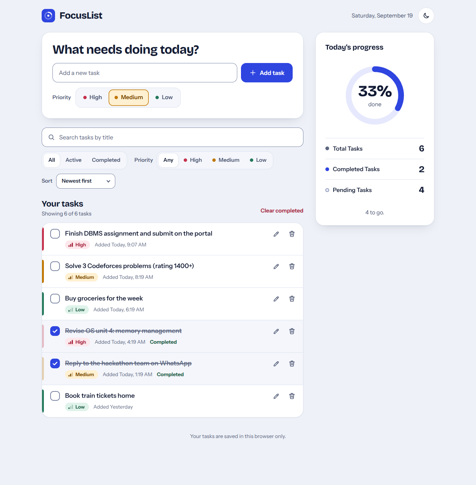
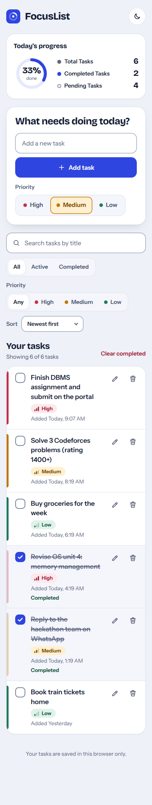

A fast, accessible, frontend-only to-do app. Add tasks, give them a priority, search and filter, and watch your progress ring fill up. Everything is stored in the browser, so there is no backend and no account.

**Live demo:** _add your deployed URL here_

| Desktop | Mobile |
| --- | --- |
|  |  |

A dark theme is included too: see [docs/desktop-dark.png](docs/desktop-dark.png).

## Features

**Required**

- **Create tasks** by typing a title and pressing Enter (or _Add task_). Empty titles are rejected with a clear message.
- **Manage tasks:** mark complete, edit inline (Enter saves, Esc cancels) and delete.
- **Priority:** High, Medium or Low, shown on every task as a coloured badge with signal bars, so it never relies on colour alone. The row's left edge is also colour-coded.
- **Search and filters:** search by title, filter by All / Active / Completed, and filter by priority. All of them combine, and the list is always derived from the underlying task data.
- **Statistics:** Total Tasks, Completed Tasks and Pending Tasks, plus a progress ring. They update instantly on every change.
- **Persistence:** tasks survive a refresh through `localStorage`.

**Extras**

- Undo for _Delete_ and _Clear completed_ (an undo toast instead of a confirmation dialog).
- Sort by newest, oldest or highest priority.
- Search matches are highlighted in the list.
- Light and dark themes: follows the system setting, remembers your choice, no flash on load.
- Press `/` anywhere to jump to search.
- Adding a task while a filter would hide it clears the filter, so the new task never "disappears".
- Tasks stay in sync across browser tabs.

## Tech stack

- **React 19** with hooks (`useReducer`, `useMemo`, `memo`) and **Vite** for dev and build.
- **Plain CSS** with design tokens (custom properties). No UI library and no CSS framework, which keeps the bundle small.
- **Vitest** for unit tests.
- Fonts (Bricolage Grotesque and Instrument Sans) are self-hosted through Fontsource: no external requests.

## Getting started

```bash
npm install
npm run dev       # http://localhost:5173
npm test          # unit tests
npm run build     # production build in dist/
npm run preview   # serve the production build locally
```

Requires Node 20.19 or newer.

## Project structure

```
src/
├── main.jsx                 # entry point, loads fonts and styles
├── App.jsx                  # composes the page, owns filter state
├── constants.js             # priorities, filter/sort options, storage keys
├── components/
│   ├── Header.jsx           # brand, date, theme toggle
│   ├── StatsPanel.jsx       # progress ring + Total / Completed / Pending
│   ├── TaskForm.jsx         # add a task (title + priority)
│   ├── Toolbar.jsx          # search, status filter, priority filter, sort
│   ├── TaskList.jsx         # <ul> of tasks
│   ├── TaskItem.jsx         # one row: checkbox, title, badge, edit, delete
│   ├── EditTaskForm.jsx     # inline editor
│   ├── SegmentedControl.jsx # radio group styled as a segmented control
│   ├── PriorityBadge.jsx, HighlightedText.jsx, EmptyState.jsx,
│   │   UndoToast.jsx, ThemeToggle.jsx, icons.jsx
├── hooks/
│   ├── useTasks.js          # reducer + persistence + cross-tab sync
│   ├── useTheme.js          # light/dark
│   └── useHotkey.js         # keyboard shortcut helper
├── state/
│   └── tasksReducer.js      # pure reducer: add, toggle, edit, remove, undo...
├── utils/
│   ├── tasks.js             # filtering, sorting, stats, date formatting
│   ├── text.js              # match highlighting, pluralize
│   └── storage.js           # safe localStorage read/write + validation
└── styles/
    ├── tokens.css           # colours, fonts, radii for both themes
    ├── base.css             # reset, focus styles, utilities
    ├── layout.css           # page grid and responsive breakpoints
    └── components.css       # component styles
```

## How it works

- **Single source of truth.** The task array lives in one reducer (`state/tasksReducer.js`). Search, filters and sorting never change it: `getVisibleTasks(tasks, filters)` derives the visible list on every render, and the statistics are computed from the full array. That is why the list and the stats can never disagree.
- **Search is intentionally simple.** A case-insensitive substring check over the title. For a personal to-do list this is instant and easy to reason about.
- **Pure logic, thin UI.** Reducer and utilities are plain functions with no React or DOM, which makes them easy to test. Components only render and dispatch.
- **Safe persistence.** Data read from `localStorage` is validated and sanitised, corrupted JSON falls back to an empty list, and write failures (private mode, quota) never crash the app.
- **Undo without data loss.** Undo remembers only what was removed, so restoring a deleted task never overwrites tasks added afterwards.
- **Responsive layout.** One CSS grid re-arranged with `grid-template-areas`: a single column on phones (progress summary first), and a two-column layout with a sticky progress panel from 960px. Tested from 320px to wide desktop with no horizontal scrolling.

## Accessibility

- Semantic landmarks and headings, a skip link, and a single `h1`.
- Every control has a visible or programmatic label. Checkboxes are real `<input type="checkbox">` elements, and clicking a task title toggles it.
- Priority and status filters are native radio groups, so arrow-key navigation works.
- Visible keyboard focus everywhere; focus returns to the Edit button after editing.
- Form errors use `role="alert"` and `aria-invalid`; the result count and the undo toast are polite live regions.
- Colour is never the only signal: priority has text and signal bars, completed tasks have a strikethrough and a "Completed" label.
- Text and control contrast meet WCAG AA in both themes. `prefers-reduced-motion` is respected, and touch targets are 40px or larger.

## Performance

- About 75 kB of JavaScript and 5 kB of CSS (gzipped), with no runtime dependencies besides React.
- Self-hosted variable fonts with `font-display: swap`; only the subsets used are downloaded.
- `React.memo` on task rows and stable callbacks, so toggling one task does not re-render the rest.
- Lighthouse on the production build: Performance 99-100, Accessibility 100, Best Practices 100.

## Deployment

The build is static (`dist/`) and uses relative asset paths, so it works on any static host.

**Vercel:** push the repo to GitHub, then import it at [vercel.com/new](https://vercel.com/new). The Vite preset is detected automatically (build: `npm run build`, output: `dist`).
Or from the terminal: `npx vercel --prod`.

**Netlify:** import the repo at [app.netlify.com](https://app.netlify.com); `netlify.toml` already sets the build command and publish directory.
Or run `npm run build` and drag the `dist` folder onto [app.netlify.com/drop](https://app.netlify.com/drop).

**GitHub Pages:** run `npm run build`, then `npx gh-pages -d dist`, and enable Pages for the `gh-pages` branch.

## Keyboard shortcuts

| Key | Action |
| --- | --- |
| `/` | Focus the search box |
| `Enter` | Add task / save edit |
| `Esc` | Cancel editing |

## Data model

```js
{
  id: 'uuid',
  title: 'Finish DBMS assignment',
  priority: 'high' | 'medium' | 'low',
  completed: false,
  createdAt: 1758272400000
}
```

Stored as JSON under the `focuslist:tasks:v1` key. The theme is stored under `focuslist:theme`.

## Possible next steps

Due dates and reminders, drag-and-drop ordering, task categories, and import/export as JSON.
